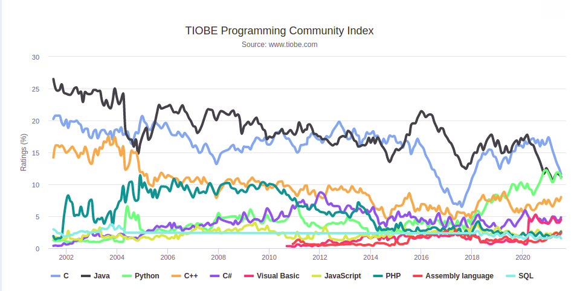

# PHP Dasar
- Pengenalan PHP
- Insatall PHP
- Tipe Data
- Variable
- Percabangan
- Perulangan
- Function
- dll


## Pengenalan PHP

PHP merupakan singkatatan dari __PHP Hypertext Preprocessor__ , PHP sendiri banyak digunakan sebagai bahasa pemrograman untuk Web Development, karana PHP pada awal pembuatan memang dikhususkan untuk dapat terintegrasi dengan bahasa web, PHP sendiri sangat populer untuk pemrograman web , bahkan hampir mayoritas web di dunia menggunakan PHP sebagai bahasa pemrogramannya.

PHP juga merupakan bahasa pemrograman yang open source, yang artinya siapa saja boleh melihat dan memodifikasi source codenya PHP, contohnya seperti di Facebook itu membuat sendiri compiler dengan bahasa PHP, selain open source PHP juga free untuk digunakan, sehinggan tidak ada biaya yang harus kita keluarkan untuk menggunakan PHP.

## Kenapa PHP
Menurut [TIOBE Programming Comunnity ](https://www.tiobe.com/tiobe-index/)PHP sendiri termasuk dalam bahasa pemrograman terpopuler di dunia, dalam arti masih banyak perusahaan atau orang-orang yang membutuhkan programmer PHP , 



## Menginsatall PHP

PHP sendiri bisa diinstall di sistem operasi manapun, namun untuk menginstall PHP secara manual tidak mudah tidak direkomendasikan karena akan sangat ribet sebagai pemula, untuk itu untuk belajar direkomdasikan menginstall PHP dengan tool-tool yang sudah mem-bundel PHP dengan teknologi pendukungnya, seperti contoh adalah XAMPP.

XAMPP sendiri merupakan tool yang sudah menyediakan PHP dan teknologi lainya seperti Web Server (Apache) dan Database Server (MySql), untuk download XAMPP bisa mengunjungi [Website Official XAMPP](https://www.apachefriends.org/index.html). 

Setelah menginsatall XAMPP kita perlu mensetting PATH PHP-nya agar bisa dieksekusi lewat Command Line, untuk yang menggunakan Linux atau MacOs bisa membuka `.bashrc` / `.profile`, kemudian menambahkan kode : 
```
export PATH="`pwd`/XAMPP/bin:$PATH"
``` 

## Program Hello World

Biasanya kalau kita belajar pemrograman aplikasi yang pertama kita buat adalah aplikasi hello world, untuk menampikan Hello World di php sangat simple , anda bisa lihat code dibawah:


```php
<?php
    echo "Hello World";
?>

```
